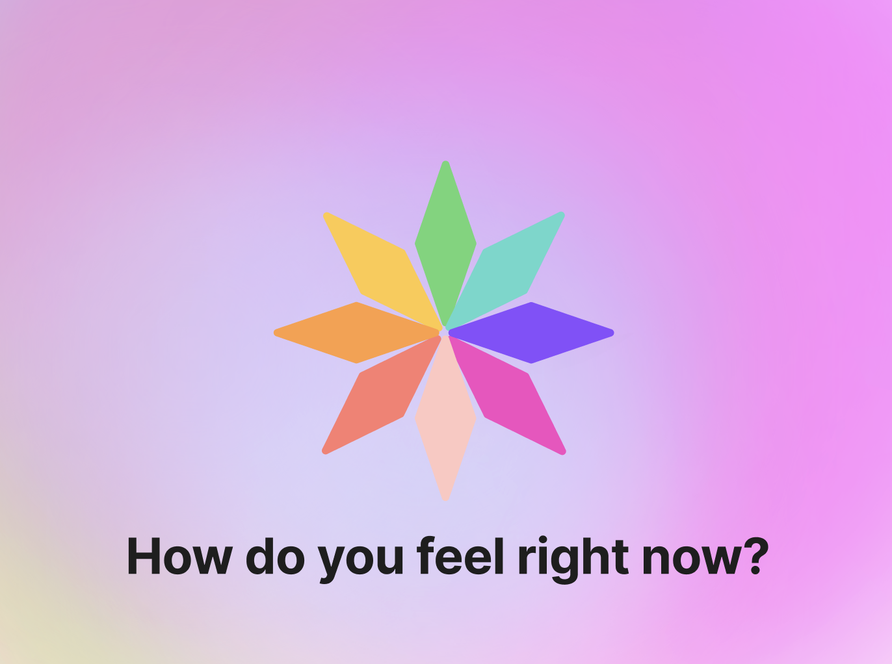
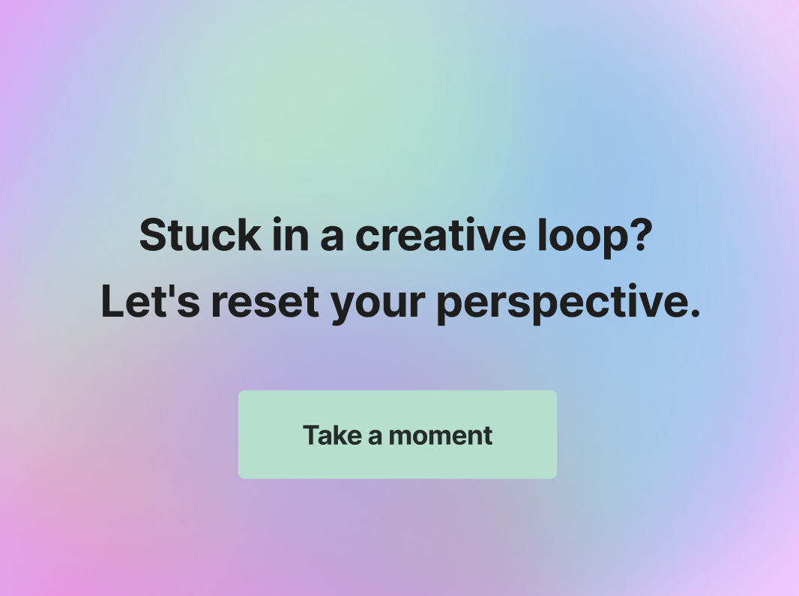
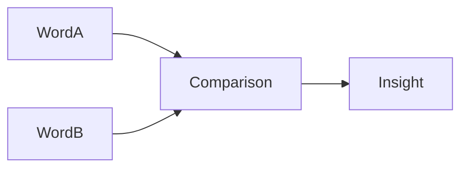
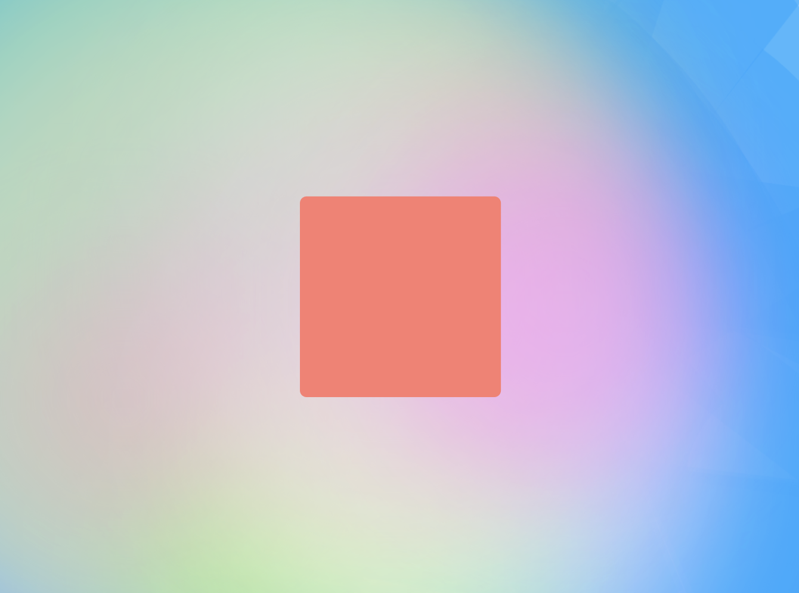
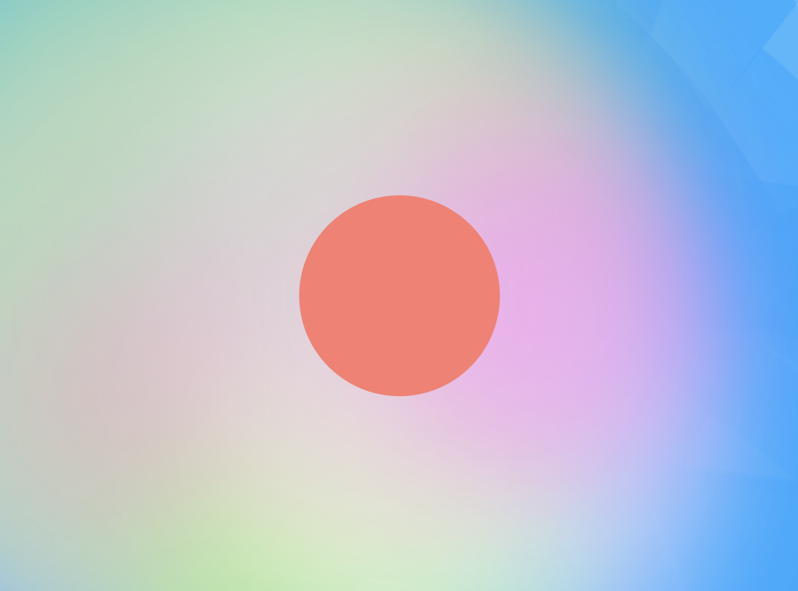
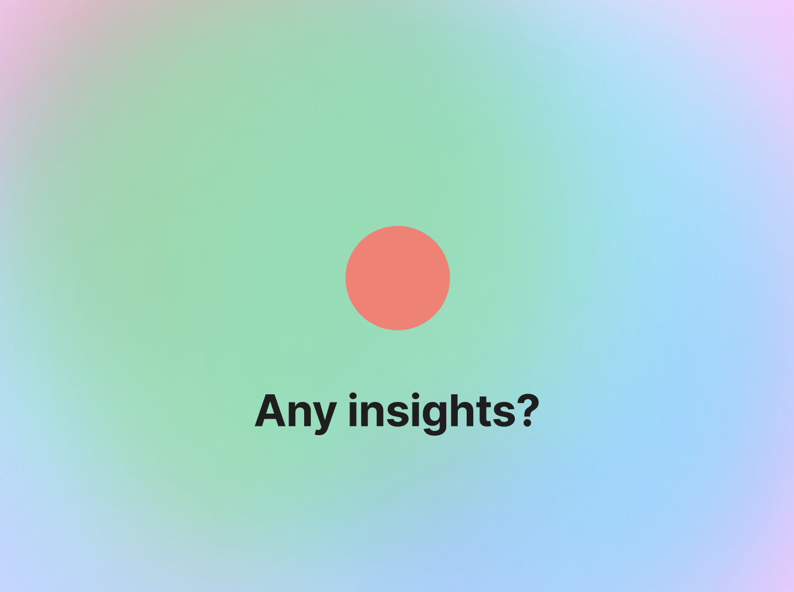

# Project Title
wander

## Overview

wander is a digital break and tool for creative block. 

### Problem Space

Nowadays, today’s digital pace often pushes users into patterns of endless scrolling - bombarded by information and stimulation constantly. The result is often a feeling of overwhelm, leading to creative block, writer’s block, or difficulty solving challenges. There aren’t enough accessible ways for users to take a break while allowing their brains to breathe during digital engagement. Existing solutions create barriers to access by implementing paywalls and subscription models. wander seeks to create an accessible solution for users.


### User Profile

- Digital workers who experience creative blocks, need mental breaks between demanding tasks, or want to maintain their stress levels
- Social media users who hope to break patterns of doomscrolling, and want to find mindful opportunities for intentional digital consumption
- Anyone that seeks a moment of calm, accessible mindfulness/breathing tools


### Features



The main feature will be a interactive animated experience.

- As a user, I want simple access to a calming environment without login requirements
- As a user, I want to pick a color that represents my existing mood or feelings
- As a user, I want to be guided through breathing exercises with smooth, calm animations and colors
- As a user, I want to receive prompts that encourage me to think creatively
- As a user, I want to pick custom session durations based on how much time I have



## Implementation

### Tech Stack

Frontend:
- [React](https://react.dev/)
- [SASS](https://sass-lang.com/)
- [Framer Motion](https://motion.dev/docs)

Backend:
- [express](https://expressjs.com/en/api.html)
- [sql](https://www.mysql.com/)
### APIs
- [random word api](https://api-ninjas.com/api/randomword)
- many color apis/or libraries
	- [random color](https://github.com/davidmerfield/randomColor)
	- [color.js](https://colorjs.io/)
	- [palette.js](https://github.com/google/palette.js/)
	- [color thief](https://github.com/lokesh/color-thief) - STRETCH GOAL: allows for color palette extraction from an image 

### Sitemap

- Start : initial view of the page, with an insightful quote to prompt the user and select a color
- Breathing - idle animation of state
- Connections - page showing 2 words, prompting the user to consider connections
- Animating - animation of colors/shapes to stimulate user
- End - ability for user to submit an insight

### Mockups
- [mockup figma link](https://www.figma.com/board/3dxnJxCPZGKbPCwFIqbGiy/Capstone?node-id=37-123&p=f&t=p0lMdqNGOcE5tEjt-0)
- [sample prototype](https://www.figma.com/proto/6NHkZ0ug7kWlQZ5g2lcc7i/Capstone-Prototype?node-id=1-35&p=f&t=BzmLAvyUZPpffw2v-1&scaling=scale-down&content-scaling=fixed&page-id=0%3A1&starting-point-node-id=1%3A3)
### Data


we have relatively simple data, so the user experience of the data was pivotal to the design of our DB

as such, our data model consists of: a `word` tablem, and a `insight` table, as well as a `user` table to 

### Word
- id: `string`
- word: `string`
### Insight
- wordIdArray : `[string]`
- userId: `string` 
### User
- id : `string` - unique token for user ip
- colorIdArray: `[string]` - user favourite colors

### Endpoints

**GET /word**

- Get random word, with an optional "quantity" for how many words we want returned

Parameters:
- quantity (optional): return `quantity` words, instead of default 1
- token(optional): JWT of the unique user

Response:
```
[
    {
        "id": 1,
        "word": "forest",
    },
    {
        "id": 2,
        "word": "tower",
    },
    ...
]
```

**POST /insight**

- user can store their insight to the `server`, and recieve a unique ID

Parameters:
- word1: string
- word2: string
- insight: string
- token(optional): JWT of the unique user

Response:
```
{
    "id": 1,
    "word1": "forest",
    "word2": "tower",
    "insight": "growth",
}
```


**GET /color**

- Get random color, with an optional "quantity" for how many words we want returned

Parameters:
- quantity (optional): return `quantity` colors, instead of default 1
- token(optional): JWT of the unique user

Response:
```
[
    {
        "id": 1,
        "color": "#7B438F",
    },
    {
        "id": 2,
        "color": "#427821",
    },
    ...
]
```

**POST /color**

- user can store their color preference to the `server`

Parameters:
- colorList: `[string]` list of color hashes that represent a users favorite colors
- token(required): JWT of the unique user

Response:
```
{
    "colorList": [ "#7B438F", "#427821" ]
}
```


## Roadmap

_______
##### Create basic shape components with Framer Motion  
1. Build the breathing animation timing system
2. Implement shape transformation tied to breath count
3. Integrate word pairs/prompts from API/local dataset
	1. API/local: Generated word pairs
	2. Local: Pre-curated creative prompts
4. Add user interactions
- STRETCH GOAL: [generative shapes](https://generativeartistry.com/tutorials/)

##### Customization
- user selected color preferences
	- changes based on day
- post-analysis of creative thought
	- user writes down insights/thoughts
		- STRETCH GOAL: ai analysis?
- add more input
	- post request - analysis + generate something back
	- swipe interactions instead of timer
		- done with shape, user clicks arrow or drags screen
			- STRETCH GOAL: drag and drop
- regular shape/image and triangulate
- box breathing exercise
- drag mouse interaction



---

## Future Implementations

possible future implementations include:
- Generative sound
- Custom emotional state mapping - Mapping colors to emotional states
- Ability for users to save their preferred journeys/input and export insights  
- Create different “journeys/experiences”
- Increased accessibility in the future iterations
  
General inspiration we'd like to implement in future iterations:  
https://conceptnet.io/  
https://www.datamuse.com/api/  
https://www.wordsapi.com/  
https://tonejs.github.io/  
https://mubert.com/blog/introducing-mubert-api-2-0  
https://github.com/3xl/ampermusic

